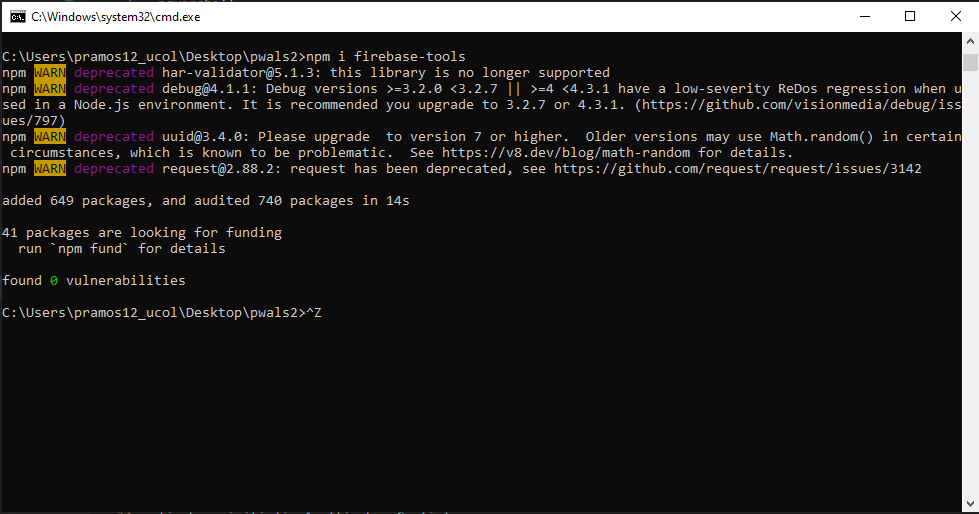
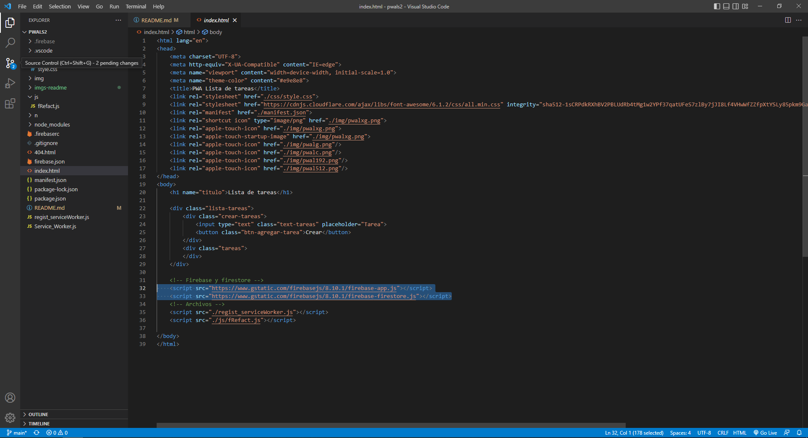
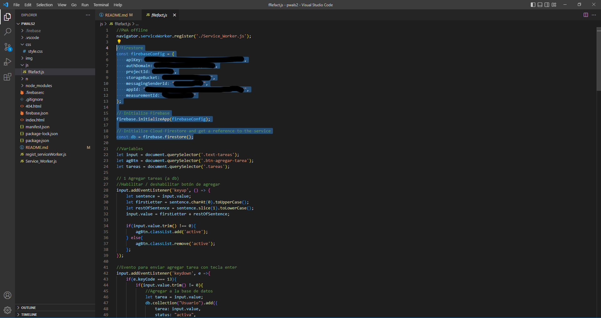
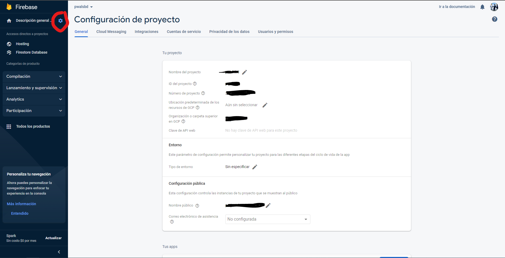

# Lista de tareas con firestore

Esta es una lista de tareas conectada a una base de datos donde las almacena y las recupera.

**Dependencias requeridaas**

powershell

npm i firebase-tools

Para ejecutar este comando debes estar en el cmd y estar situado en el directorio raíz donde la vas a ejecutar.

Ejemplo:
C:\Users\tu-usuario\ruta-de-la-carpeta>npm i firebase-tools




HTML
``` javascript
<script src="https://www.gstatic.com/firebasejs/8.10.1/firebase-app.js"></script>
<script src="https://www.gstatic.com/firebasejs/8.10.1/firebase-firestore.js"></script>
```

Ejemplo:


Debes agregar estos scripts cuya función es conectarse primeramente a firebase que es lo que se está utilizando como 
medio para hostear y el siguiente es para conectarse a la base de datos de firebase, es decir, firestore.

JS
``` javascript
const firebaseConfig = {

    apiKey: "El contenido que aparezca en tu firebaseconfig",

    authDomain: "El contenido que aparezca en tu firebaseconfig",

    projectId: "El contenido que aparezca en tu firebaseconfig",

    storageBucket: "El contenido que aparezca en tu firebaseconfig",

    messagingSenderId: "El contenido que aparezca en tu firebaseconfig",

    appId: "El contenido que aparezca en tu firebaseconfig",

    measurementId: "El contenido que aparezca en tu firebaseconfig"

};

firebase.initializeApp(firebaseConfig);

const db = firebase.firestore();
```

Ejemplo:


Este apardado de código para la configuración se obtiene entrando a la configuración del proyecto en firebase presionando el ícono de engrane.


En la página que carga, ve hacia el fondo donde te aparecerá un código, seleccionas la opción de "config" tal como aparece en la imágen, lo copias y lo pegas en el archivo js.


Esto se debe de colocar al principio del archivo de js para que se pueda establecer la conexión con la base de datos.

El "firebaseconfig" es un SDK que contiene la api para conectarse a nuestra base de datos específica.

El siguiente comando es para que inicialice la aplicación y se establezca la conexión.

Y la tercera que se guarda como una constante, es para que la puedas referenciar para leer, eliminar y modificar los datos
de firestore.