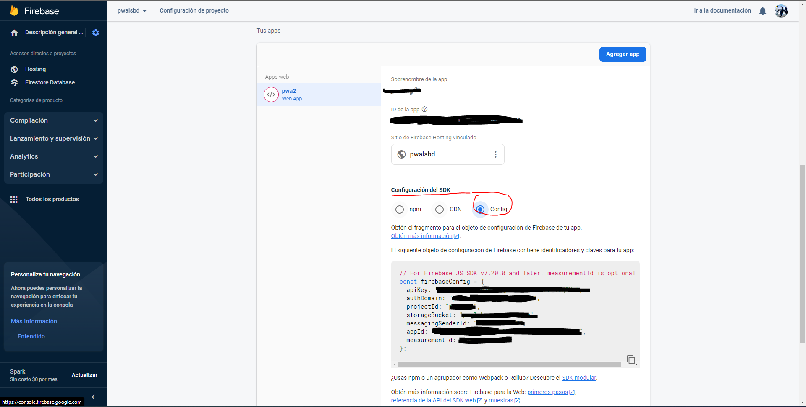

# Lista de tareas con firebase y firestore

Esta es una lista de tareas conectada a una base de datos donde las almacena y las recupera.

**Dependencias requeridaas**

powershell

npm i firebase-tools

Para ejecutar este comando debes estar en el cmd y estar situado en el directorio raíz donde la vas a ejecutar.

Ejemplo:
C:\Users\tu-usuario\ruta-de-la-carpeta>npm i firebase-tools


# Hostear con firebase

Ahora se hace loogin dentro de la carpeta con el comando

powershell

firebase login

Ahí iniciaras sesión con la cuenta que utilizarás para acceder al proyecto

Ahora se debes iniciar firebase con el comando

powershell

firebase init

Te aparecerá algo como lo siguiente:


Como se ve en la imagen pones la letra "Y"

Posterior a esto aparecerán varias opciones de hosteeo y deberás ubicar con las fechas la opción siguiente


Deberás seleccionarla con la barra espaciadora

Después de esto deberás seleccionar el proyecto que quieres hostear, te aparecerá dependiendo de los proyectos que tengas 
y el nombre que les hayas puesto


Posterior a esto te aparecerá una opción para que selecciones el directorio donde se encuentra el proyecto, ahí pondrás "./"
Después te preguntará si quieres configurar como página de inicio, ahí pondrás "No"
Después preguntará si quieres que los despliegues se hagan automaticamente con github, ahí pondrás "No"
Finalmente preguntará que si ya exise el archivo index.html lo reescriba, ahí pondrás "No"    


Finalmente aparecerá el mensaje de que firebase se ha inicializado correctamente y para actualizar el proyecto según tu código
deberás ejecutar el comando firebase deploy desde cmd en el archivo raíz de tu proyecto.

powershell

firebase deploy

Después de esto te aparecerá un link donde se encuentra el proyecto hosteado. Es el link que deberás copiar y pegar en el navegador.
(consejo al cargar la página y actualizar para cambios presion ctrl + f5)

# Implementar base de datos firestore

HTML
``` javascript
<script src="https://www.gstatic.com/firebasejs/8.10.1/firebase-app.js"></script>
<script src="https://www.gstatic.com/firebasejs/8.10.1/firebase-firestore.js"></script>
```

Ejemplo:


Debes agregar estos scripts cuya función es conectarse primeramente a firebase que es lo que se está utilizando como 
medio para hostear y el siguiente es para conectarse a la base de datos de firebase, es decir, firestore.

JS
``` javascript
const firebaseConfig = {

    apiKey: "El contenido que aparezca en tu firebaseconfig",

    authDomain: "El contenido que aparezca en tu firebaseconfig",

    projectId: "El contenido que aparezca en tu firebaseconfig",

    storageBucket: "El contenido que aparezca en tu firebaseconfig",

    messagingSenderId: "El contenido que aparezca en tu firebaseconfig",

    appId: "El contenido que aparezca en tu firebaseconfig",

    measurementId: "El contenido que aparezca en tu firebaseconfig"

};

firebase.initializeApp(firebaseConfig);

const db = firebase.firestore();
```

Ejemplo:


Este apardado de código para la configuración se obtiene entrando a la configuración del proyecto en firebase presionando el ícono de engrane.


En la página que carga, ve hacia el fondo donde te aparecerá un código, seleccionas la opción de "config" tal como aparece en la imágen, lo copias y lo pegas en el archivo js.


Esto se debe de colocar al principio del archivo de js para que se pueda establecer la conexión con la base de datos.

El "firebaseconfig" es un SDK que contiene la api para conectarse a nuestra base de datos específica.

El siguiente comando es para que inicialice la aplicación y se establezca la conexión.

Y la tercera que se guarda como una constante, es para que la puedas referenciar para añadir, leer, modificar y eliminar los datos
de firestore.

Añadir datos(tareas).


Leer y mostrar datos(tareas).


Modificar datos(tareas).


Eliminar datos(tareas).
